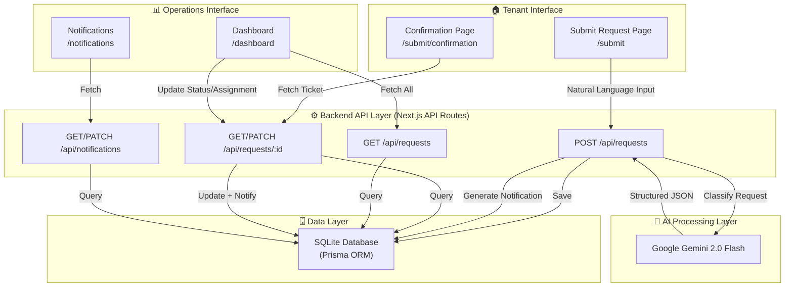
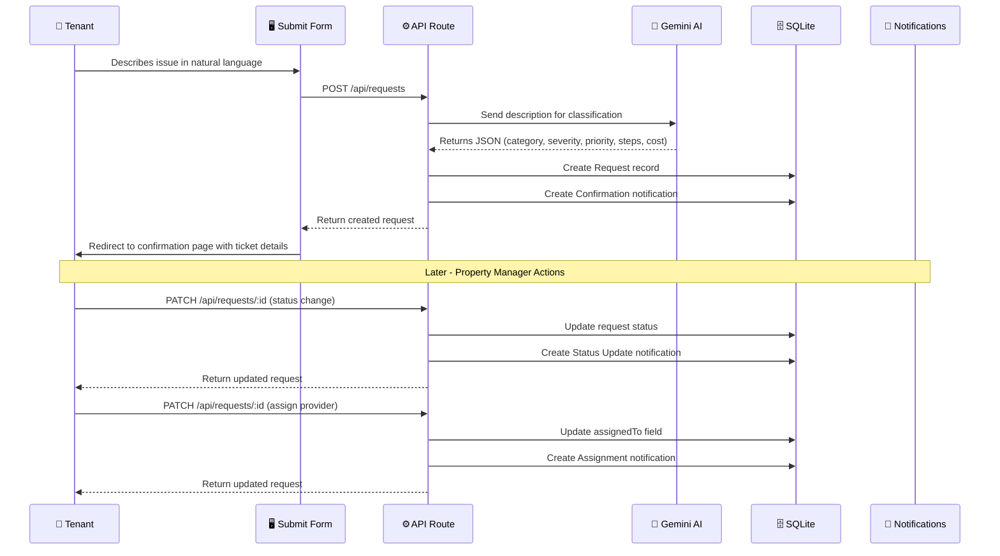
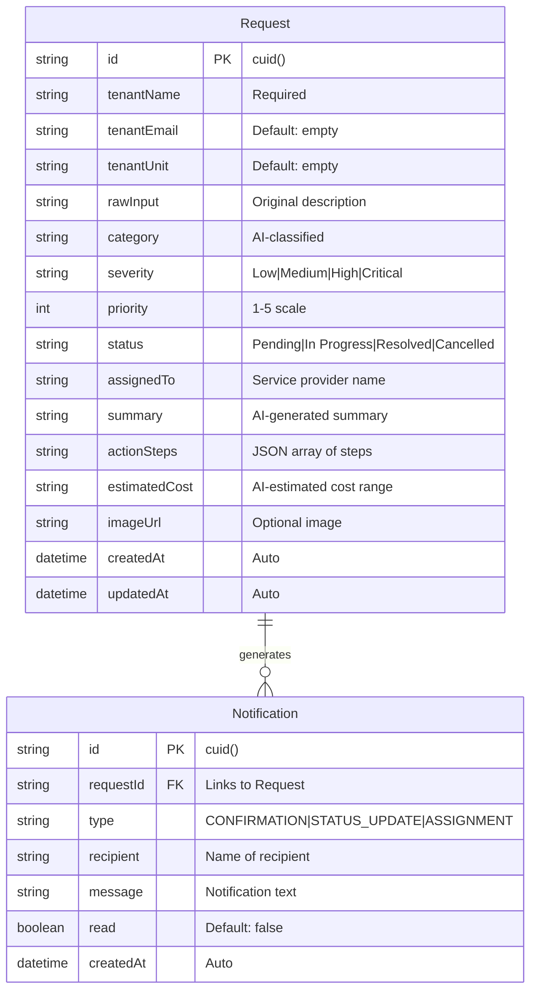
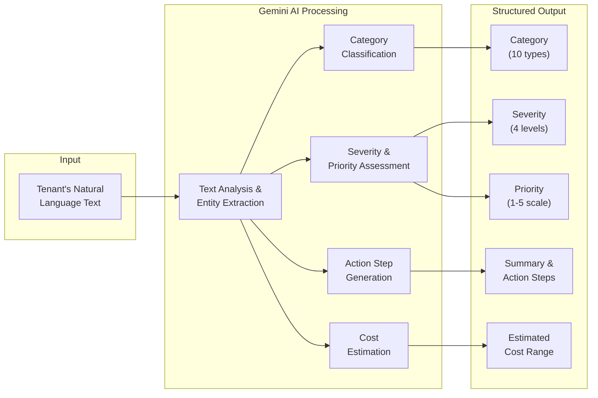
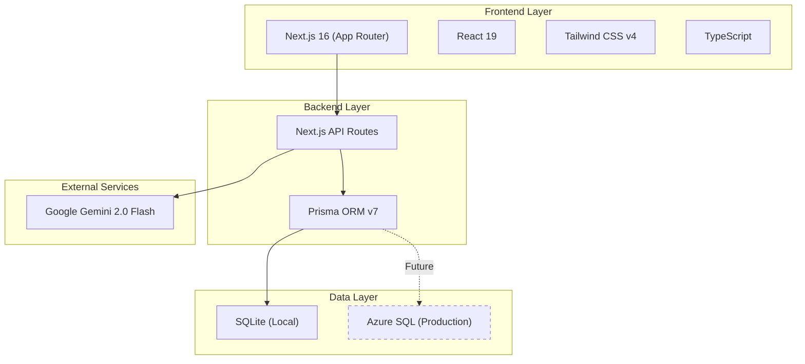

# MaintenanceAI — System Architecture

## High-Level Architecture



## Request Processing Flow



## Data Model



## AI Classification Pipeline



## Technology Stack Diagram



## Directory Structure

```
maintenance-app/
├── app/
│   ├── api/
│   │   ├── requests/
│   │   │   ├── route.ts          # GET all, POST new
│   │   │   └── [id]/
│   │   │       └── route.ts      # GET one, PATCH update
│   │   └── notifications/
│   │       └── route.ts          # GET all, PATCH mark read
│   ├── dashboard/
│   │   └── page.tsx              # Operations dashboard
│   ├── notifications/
│   │   └── page.tsx              # Notification center
│   ├── submit/
│   │   ├── page.tsx              # Request submission form
│   │   └── confirmation/
│   │       └── page.tsx          # AI ticket confirmation
│   ├── globals.css               # Design system & animations
│   ├── layout.tsx                # Root layout with SEO
│   └── page.tsx                  # Landing page
├── components/
│   ├── Navbar.tsx                # Navigation with mobile menu
│   ├── Toast.tsx                 # Toast notification system
│   └── ui.tsx                    # Shared UI components
├── lib/
│   ├── db.ts                     # Prisma client singleton
│   └── gemini.ts                 # Gemini AI integration
├── prisma/
│   └── schema.prisma             # Database schema
├── generated/
│   └── client/                   # Generated Prisma client
├── .env                          # Environment variables
├── Solution_Overview.md          # Solution documentation
└── Architecture.md               # This file
```
