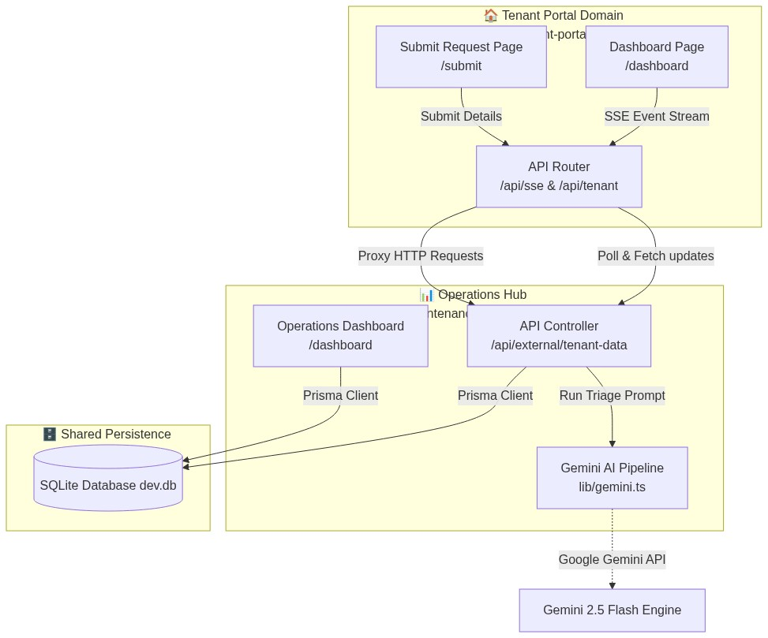
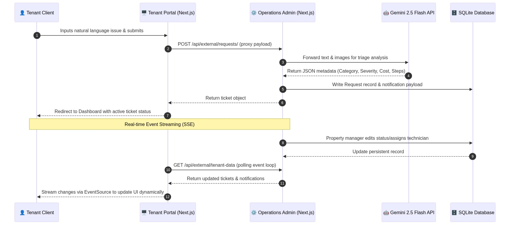
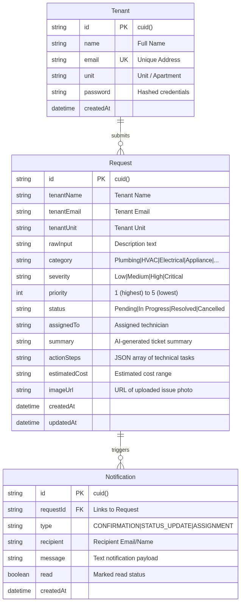
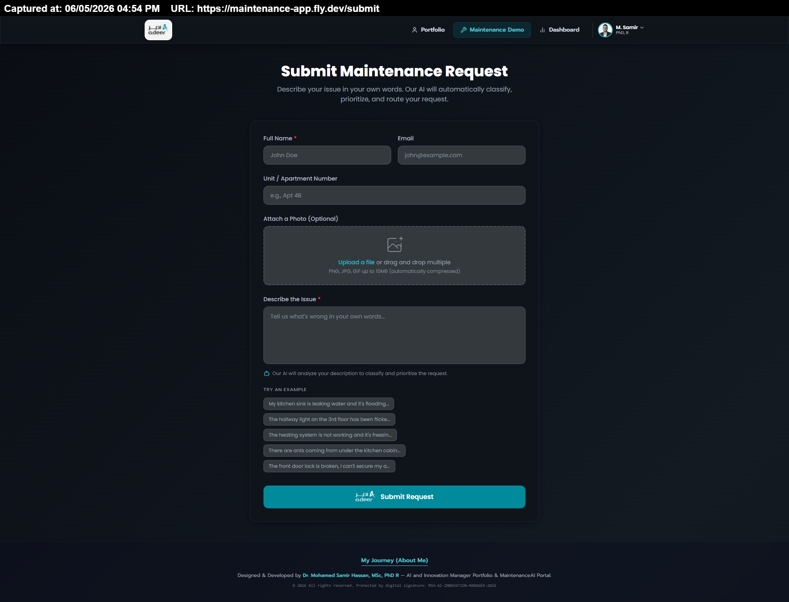
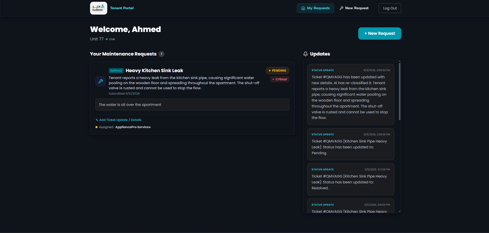
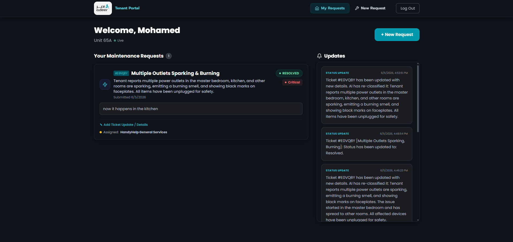
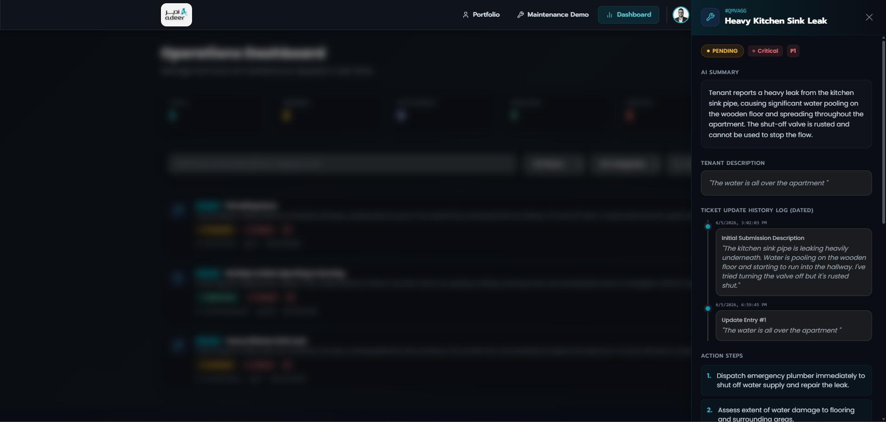
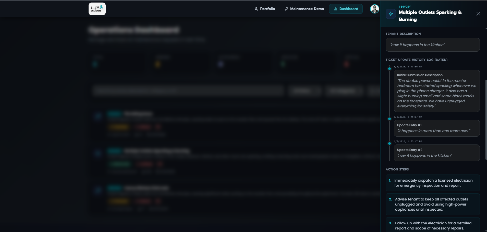

# MaintenanceAI & Tenant Portal — Software Engineering & System Architecture Specification

This document details the system design, database architecture, AI integration pipeline, and cross-application synchronization of **MaintenanceAI** (admin operations panel) and the **Tenant Portal**. 

---

## 1. System Topology & High-Level Architecture

The platform uses a split-responsibility dual-application topology. This topology ensures administrative features and data mutation controls reside on a protected backend container, while tenants access a streamlined portal. Both apps interact with a single SQLite database running in WAL (Write-Ahead Logging) mode, resolving data conflicts through dedicated secure REST endpoints.



### Request Flow Sequence Diagram

This sequence diagram outlines how requests are parsed by AI, saved, and synced in real-time between tenant and manager views.



---

## 2. Technology Stack & Core Directories

Both applications are built with modern web technologies:

*   **Frontend UI & Framework**: [Next.js 16 (App Router)](file:///c:/Users/ahmed/OneDrive/Documents/Innovation%20Manager%20Technical%20Challenge/tenant-app/package.json) & [React 19](file:///c:/Users/ahmed/OneDrive/Documents/Innovation%20Manager%20Technical%20Challenge/tenant-app/package.json).
*   **Design System & Brand Identity**: Custom CSS variables matching the **Adeer Navy & Teal theme**, using custom Poppins typography, rounded-2xl glassmorphism, pulse loading animations, and responsive layouts.
*   **Database ORM**: Prisma Client v7 querying a local SQLite datastore inside WAL mode to prevent locking during concurrent reads/writes.
*   **AI Engine**: Google Gemini 2.5 Flash API for automated categorization, cost assessment, prioritization, and technician task checklist generation.

### Key File Mapping

*   **Operations Hub App**: [maintenance-app](file:///c:/Users/ahmed/OneDrive/Documents/Innovation%20Manager%20Technical%20Challenge/maintenance-app)
    *   [schema.prisma](file:///c:/Users/ahmed/OneDrive/Documents/Innovation%20Manager%20Technical%20Challenge/maintenance-app/prisma/schema.prisma) — Database schema definitions.
    *   [gemini.ts](file:///c:/Users/ahmed/OneDrive/Documents/Innovation%20Manager%20Technical%20Challenge/maintenance-app/lib/gemini.ts) — Prompt engineering and JSON parser.
    *   [external/tenant-data/route.ts](file:///c:/Users/ahmed/OneDrive/Documents/Innovation%20Manager%20Technical%20Challenge/maintenance-app/app/api/external/tenant-data/route.ts) — Cross-domain synchronizer API.
*   **Tenant Portal App**: [tenant-app](file:///c:/Users/ahmed/OneDrive/Documents/Innovation%20Manager%20Technical%20Challenge/tenant-app)
    *   [sse/route.ts](file:///c:/Users/ahmed/OneDrive/Documents/Innovation%20Manager%20Technical%20Challenge/tenant-app/app/api/sse/route.ts) — Server-Sent Events client-stream connector.
    *   [dashboard/page.tsx](file:///c:/Users/ahmed/OneDrive/Documents/Innovation%20Manager%20Technical%20Challenge/tenant-app/app/dashboard/page.tsx) — Main tenant tracking workspace.
    *   [page.tsx](file:///c:/Users/ahmed/OneDrive/Documents/Innovation%20Manager%20Technical%20Challenge/tenant-app/app/page.tsx) — Dynamic authentication portal.

---

## 3. Database Schema

The SQLite database is managed using Prisma. The structure of the core tables is defined below:



---

## 4. Platform Interface Walkthrough (with Deployed Screenshots)

### 4.1 Tenant Portal Authentication

The Tenant Portal includes validation on both the client and server. If a tenant's session becomes invalid or expires, the system automatically redirects them to the login screen.


*Figure 1: Tenant Login Page featuring custom background orbs, glassmorphic inputs, and a custom loading animation using the pulsing Adeer logo inside the "Sign In" action button.*

---

### 4.2 Ticket Submission Form

The submit form features templates that allow tenants to quickly auto-populate common issue descriptions. The description is processed by the AI pipeline.


*Figure 2: Maintenance submission form showing the one-field natural language description field, templated quick-fills, and photo upload controls.*

---

### 4.3 Automated AI Classification & Triage Pipeline

When a request is submitted, it is processed by the Gemini AI pipeline. The text description and any attached photos are analyzed to determine the ticket's category, urgency rating, estimated repair costs, and a structured set of repair steps.

```typescript
// Prompt template from lib/gemini.ts
const prompt = `You are an AI assistant for a property management company. Analyze the following maintenance request (and any attached images) from a tenant and provide a structured classification.

Respond ONLY with a valid JSON object:
{
  "category": "Plumbing | Electrical | HVAC | Structural | Appliance | Pest Control | Cleaning | Security | Landscaping | General",
  "severity": "Low | Medium | High | Critical",
  "priority": "1 (highest) to 5 (lowest)",
  "summary": "Professional summary of the issue",
  "actionSteps": ["step 1", "step 2", "step 3"],
  "estimatedCost": "Estimated cost range (e.g. $100-$200)"
}`;
```

The property manager sees this metadata inside the ticket sidebar:


*Figure 3: Operations details panel showing the AI-calculated severity (Critical), priority (P1), estimated repair cost range, and the checklist generated by Gemini.*

---

### 4.4 Operations Control Dashboard

The Operations Hub dashboard provides property managers with statistical counters, global search functionality, status filters, and priority tags to help manage incoming requests.


*Figure 4: Operations admin dashboard showing active maintenance tickets, search tools, statistics, and category filters.*

---

### 4.5 Live Client-Side Synchronization (SSE)

The Tenant Portal dashboard establishes a Server-Sent Events (SSE) connection to listen for updates. When a property manager updates a ticket's status, the change is streamed to the tenant's browser, updating the dashboard instantly without requiring a page reload.


*Figure 5: Tenant Dashboard showing the green "Live" synchronization status indicator next to the apartment details, alongside the real-time request tracker and browser notification toggles.*

---

## 5. Key Engineering Solutions & Fixes Implemented

1.  **EventSource Auto-Reconnection & Heartbeats**:
    To prevent routers and firewalls from dropping idle SSE streams, the server sends regular keep-alive pings. If a connection drops, the client automatically attempts to reconnect every 5 seconds, updating the status indicator to `Reconnecting...` during the downtime.
2.  **Cross-App State Sync**:
    To avoid data drift between the admin and tenant applications, the Tenant Portal fetches all ticket data directly from the admin database using secure REST calls. This configuration creates a single source of truth for the system's data.
3.  **Dynamic Image Scale & Pulsing Spinner**:
    Unified the loading screens across both applications to use a custom pulsing Adeer logo. Sizing class configurations use height-based scaling (`h-5 w-auto`) to preserve the logo's aspect ratio on different screen sizes.
